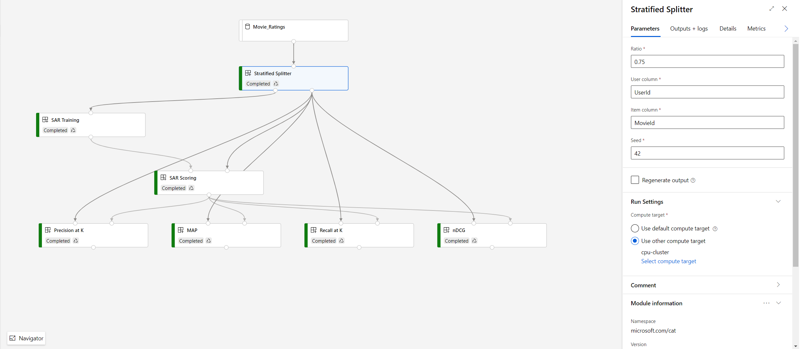

# AzureML Module Get Started

[TOC]

## Introduction

Machine learning projects may start from a notebook or simply Python script but quickly mature into a complex set of interwoven steps and dependencies. Many companies use pipelines to create workflows in their ML projects to help move from exploration into iteration and operationalization to production. 

Building an ML pipeline from scratch requires significant domain knowledge and collaboration from different roles. Organizations frequently request the ability to use templates to create their ML pipelines, modularize the code and share/reuse them in the organization.

[Azure Machine Learning pipelines](https://docs.microsoft.com/en-us/azure/machine-learning/concept-ml-pipelines) can help organizations build, optimize, and manage ML workflows with various types of [PipelineStep](https://docs.microsoft.com/en-us/python/api/azureml-pipeline-core/azureml.pipeline.core.builder.pipelinestep?view=azure-ml-py). However, the challenges to develop an AzureML pipeline are:

- The construction of the step assumes that the scripts and dependent files required must be locally available. If data scientists want to build on top of existing code, the scripts and dependencies often must be cloned from a separate repository which makes it difficult to share & reuse. There’s no version management to the code used in different pipelines which makes reproducibility challenging.

- The definition of a pipeline cannot be divorced from the code that is run. If data scientists want to make any changes to their pipeline, even to change one line, they have to resubmit the whole pipeline to remote compute target and wait for a long time to debug/troubleshoot.

Azure Machine Learning now allows data scientists and developers to componentize their code as modules, which are building blocks for a specific task like data preprocessing & postprocessing, model training, evaluation, inference, drift analysis and more. Modules can be run interactively, executed on their own remotely or integrated into machine learning pipelines. Like functions in most programing languages, modules abstract the code logic with name and interface. They are defined once and can be used in different scenarios. Compared with pipeline steps, modules make code testable as components instead of submitting a whole complex pipeline. Modules can also be shared and reused across pipelines. They can be managed in versions with [Azure Command Line Interface (CLI)](cli/doc.md). With Azure Machine Learning modules, data scientists or developers can easily build and debug a pipeline, efficiently collaborate, and iterate on existing pipelines.

## What is AzureML Module?

An AzureML **module** represents a unit of computation, with a **command** **(script/exe/dll/bash)** that can run on compute target, [**environment**](https://docs.microsoft.com/en-us/azure/machine-learning/concept-environments) and [**snapshot**](https://docs.microsoft.com/en-us/azure/machine-learning/concept-azure-machine-learning-architecture#snapshots) which includes the script, binaries, and other files necessary to execute the script/exe/dll/bash. Module has predefined **interface**, including **inputs** and **outputs** that can be mapped to the command. Data scientists or developers can wrap their code as modules by following a [yaml specification](specs/module-spec-definition.md) (with VSCode intellisense validation).

Modules can be created interactively or through managed CI/CD processes (from Git repositories and supported CI/CD ecosystems). Data scientists simply use the Azure Machine Learning CLI to register a custom module into a workspace, with source code from a GitHub public repo, Azure DevOps artifacts or local files. 

1. Once a module is registered into the workspace, you can use the AzureML Python SDK or drag and drop UI ([Azure Machine Learning designer (preview)](https://docs.microsoft.com/en-us/azure/machine-learning/concept-designer)) to easily build your own pipelines. The Azure Machine Learning CLI allows you to manage module versions, disable modules or check module details like source, definition, etc. The code on how to construct a pipeline can be exported to Python notebook for other team members to reuse and iterate.

## Get Started

In this document, we use [SAR recommender](https://github.com/microsoft/recommenders/blob/master/notebooks/00_quick_start/sar_movielens.ipynb) from [Microsoft Recommenders best practice repo](https://github.com/microsoft/recommenders) to walk you through the steps to start developing, managing and consuming AzureML modules.

### Prerequisites

- An Azure subscription and machine learning workspace set up ([how to](https://azure.microsoft.com/en-us/trial/get-started-machine-learning/))
- The code/scripts and dependency files to be modularized – e.g. [recommender utilities](https://github.com/microsoft/recommenders/tree/master/reco_utils)

### Module development

To wrap existing code as modules, you need to:

1. Define how many modules you need and the interface of each module – e.g. [SAR recommender notebook](https://github.com/microsoft/recommenders/blob/master/notebooks/00_quick_start/sar_movielens_with_azureml.ipynb) can be translated to a pipeline with 7 custom modules:

   

2. For each module, prepare an entry script (e.g. [stratified_splitter_entry.py](https://github.com/microsoft/recommenders/blob/master/reco_utils/azureml/azureml_designer_modules/entries/stratified_splitter_entry.py)) to invoke from command line and execute the code logic.

3. For each module, prepare a yaml (e.g. [stratified_splitter.yaml](https://github.com/microsoft/recommenders/blob/master/reco_utils/azureml/azureml_designer_modules/module_specs/stratified_splitter.yaml)) by following this [module spec](specs/module-spec-definition.md).

   - The input/output data type (shown as port type in UI) is used for system to decide whether two ports can be connected in a pipeline. Port type can be any string without "<" and ">". If it's not "AnyFile" or "AnyDirectory", you need to register ([Python SDK](https://aka.ms/azureml-sdk-create-data-type)) the customized data type first before using it in module spec.
   - AzureML service will use the parent folder of the yaml file to package as snapshot. If your source code and dependencies are not in the same folder with your yaml file, you can use field **[additionalIncludes](specs/topics/additional-includes.md)** to specify it.

### Module registration and management

AzureML provides command line interface ([Azure CLI](cli/doc.md)) for module registration and management. Refer to this [walk through](cli/walk-through.md) to register a module from GitHub repo, local folder or a zip package (typically created by a DevOps CI build job), update module to a new version and set its default version, disable/enable module, list and download module, etc.

- “namespace” + “name” uniquely identifies a module in a workspace. So, make sure “version” is updated in the yaml every time you want to upgrade a module. 

- Batch register – current module CLI supports one module per registration. If you want to batch register, you can leverage shell/batch/PowerShell script to iterate over directory. We leave this to our customers to allow more flexibility e.g. – you can decide if you want to use a specific naming pattern of the YAML files. An example to batch register the recommenders modules can be found in “Module Registration” section of this [tutorial](https://github.com/microsoft/recommenders/blob/master/notebooks/00_quick_start/sar_movieratings_with_azureml_designer.ipynb).

In addition to Azure CLI, corresponding UX experience is provided for module management. Contact us: <stcamlstudio@microsoft.com> to be involved in the preview of the experience.

### Module consumption

#### Python SDK

A new Python SDK is provided to help you easily use custom modules to build a pipeline. Follow this [sample notebook](https://github.com/lisagreenview/hello-aml-modules/blob/master/pipeline_recommender.ipynb) to see how to build a SAR pipeline using previously registered modules. Full SDK reference document can be found here.

- The input/output/parameter names called from the SDK should follow the Python language pattern, i.e. using “_” to replace space in the names.

#### Designer

Once a module is registered in workspace, you can use Designer to drag and drop building a pipeline (contact us: <stcamlstudio@microsoft.com>) to be involved in the preview of the experience). During authoring, you can specify the target version when dragging into the canvas or on the module right pane if you don’t want to stick to default version.

